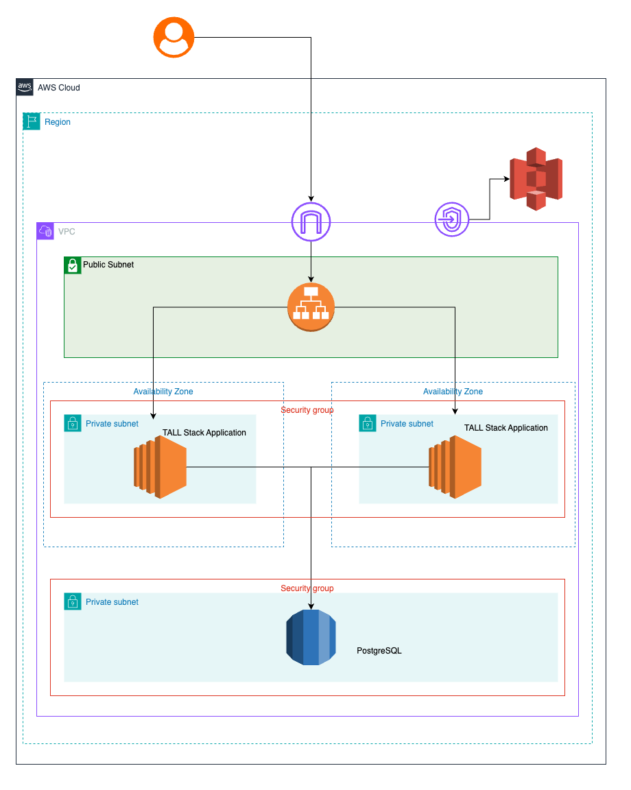

# Hands-on Lab: Deploying CRUD App on AWS using EC2, RDS, and ALB
<a id="readme-top"></a>
## Overview
This project demonstrates deploying a **simple web application** on AWS using:
- **Application Load Balancer (ALB)** for distributing traffic
- **Two EC2 instances** running the same backend application
- **Amazon RDS** as the database backend

The setup ensures **high availability, scalability, and security**.

## Architecture Diagram


<p align="right">(<a href="#readme-top">back to top</a>)</p>

## Prerequisites
### **Before You Begin**
Ensure you have the following:
- **AWS Account** with admin privileges
- **AWS CLI** installed and configured (`aws configure`)
- **Terraform (Optional)** if deploying via Infrastructure-as-Code
- **GitHub Repository** for version control

<p align="right">(<a href="#readme-top">back to top</a>)</p>

## Deployment Steps
### **1. Set Up AWS Resources**
#### **A. Create RDS Database**
1. Go to AWS **RDS Console**.
2. Click **Create Database** → Select **MySQL/PostgreSQL**.
3. Choose **DB Instance Class** (e.g., `db.t3.micro`).
4. Set database credentials (`DB_USER`, `DB_PASSWORD`).
5. Enable **Public Access** (for testing, restrict later via Security Groups).
6. Click **Create Database**.

#### **B. Create EC2 Instances**
1. Go to AWS **EC2 Console**.
2. Click **Launch Instance** → Choose **Amazon Linux 2** (or Ubuntu).
3. Select **Instance Type** (`t3.micro` for free tier).
4. Attach **IAM Role** with RDS access.
5. Configure **Security Groups**:
   - Allow **port 22 (SSH)** (your IP only)
   - Allow **port 5000 (app port)** from ALB
6. Click **Launch**.

#### **C. Set Up Application Load Balancer (ALB)**
1. Go to AWS **EC2 Console → Load Balancers**.
2. Click **Create Load Balancer** → Choose **Application Load Balancer**.
3. Configure:
   - **Listener**: HTTP (port 80)
   - **Target Group**: Attach **EC2 instances**
   - **Health Check Path**: `/health` (or `/` if not defined)
4. Click **Create Load Balancer**.

### **2. Deploy Application to EC2**
1. **SSH into EC2 instance**:
   ```sh
   ssh -i your-key.pem ec2-user@your-ec2-ip
   ```
2. **Install dependencies**:
   ```sh
   sudo yum update -y
   sudo yum install python3 pip -y
   ```
3. **Clone the repository**:
   ```sh
   git clone https://github.com/your-repo/aws-crud-app.git
   cd aws-crud-app
   ```
4. **Set environment variables**:
   ```sh
   export DB_HOST="your-rds-endpoint"
   export DB_USER="your-db-username"
   export DB_PASSWORD="your-db-password"
   ```
5. **Run the application**:
   ```sh
   python3 app.py
   ```

### **3. Test the Setup**
- Open **ALB DNS URL** in a browser.
- Use **Postman or cURL** to test CRUD operations:
  ```sh
  curl -X POST http://your-alb-dns/items -H "Content-Type: application/json" -d '{"name": "Sample Item"}'
  ```

<p align="right">(<a href="#readme-top">back to top</a>)</p>

## Troubleshooting & Common Issues
### **1. ALB Not Routing Traffic**
- Ensure EC2 **Security Group allows ALB inbound traffic** on port **5000**.
- Verify **Target Group health checks** are passing.

### **2. RDS Connection Errors**
- Ensure RDS **Public Access** is enabled (for testing).
- Check **Security Group** allows **EC2 IP access on port 3306/5432**.
- Use:
  ```sh
  telnet your-rds-endpoint 3306
  ```
  to test connectivity.

### **3. Application Not Starting**
- Check logs: `journalctl -u your-app --no-pager -n 50`
- Verify Python dependencies: `pip install -r requirements.txt`

<p align="right">(<a href="#readme-top">back to top</a>)</p>

## Screenshots
### **AWS Console: RDS Setup**

### **AWS Console: ALB Target Group**


<p align="right">(<a href="#readme-top">back to top</a>)</p>

## Repository & Deployment Automation
### **1. GitHub Actions for CI/CD (Optional)**
1. Create `.github/workflows/deploy.yml` with deployment steps.
2. Configure **AWS IAM Role** for GitHub Actions.
3. Automate deployments via `git push`.

<p align="right">(<a href="#readme-top">back to top</a>)</p>

## Contributors
- **Your Name** | GitHub: [your-username](https://github.com/your-username)
- **Computrade Technology Philippines Inc.**

<p align="right">(<a href="#readme-top">back to top</a>)</p>

## License
Distributed under MIT License. See `LICENSE.txt` for details.

<p align="right">(<a href="#readme-top">back to top</a>)</p>

## Contact
Get in touch with Computrade Technology Philippines (CTP)!

- Website: [Computrade Technology Philippines](https://computradetech.com.ph/)
- LinkedIn: [Computrade Technology Philippines](https://www.linkedin.com/company/computrade-technology-philippines-inc./)
- Facebook: [Computrade Technology Philippines](https://www.facebook.com/computradetechph)
- Instagram: [Computrade Technology Philippines](https://www.instagram.com/computradetechph/)

<p align="right">(<a href="#readme-top">back to top</a>)</p>
